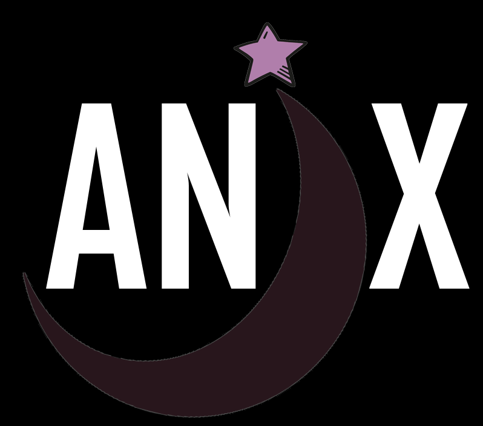

 

    
    <h3 align="center">Anix</h3>
    
 A personal anime manager

    <a href="https://anix-front-end.vercel.app" target="_blank">Anix's Webpage<a/>

# About
Do you remember all the animes you've watched? Depending on the amount, it's an almost impossible task, so Anix came to help you quickly and intuitively. Manage the status of your anime, favorite and discover new ones.

<h3>Desktop Layout</h3> 
  

<h3>Mobile Layout</h3> 
  

## Technologies
These are the main tools, frameworks and languages that were used in this project: 

### Front-End

  
  
  
  
  
  
  

### Back-End

  
  
  
  
  
  
  
  
  
  

## Authors
### Bruno Ruotolo

)

